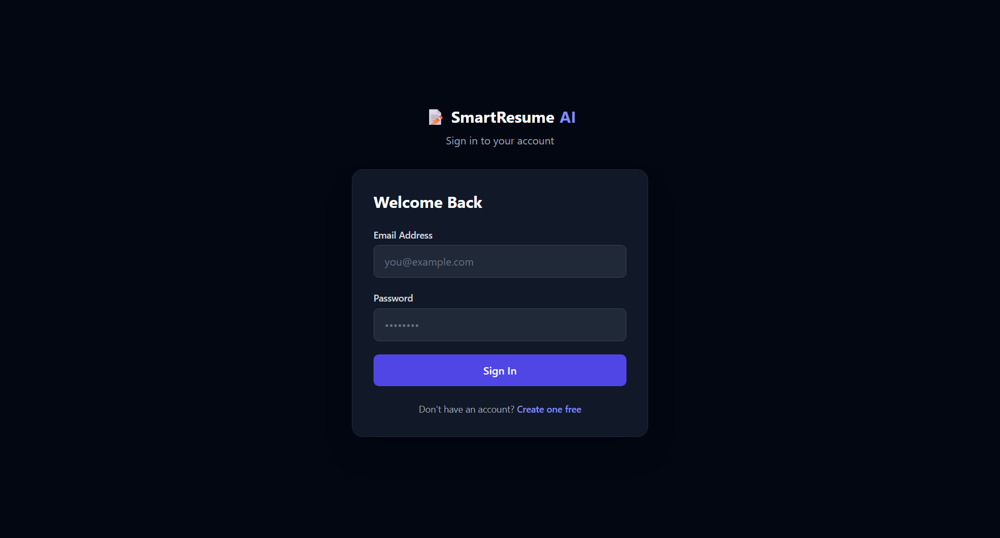
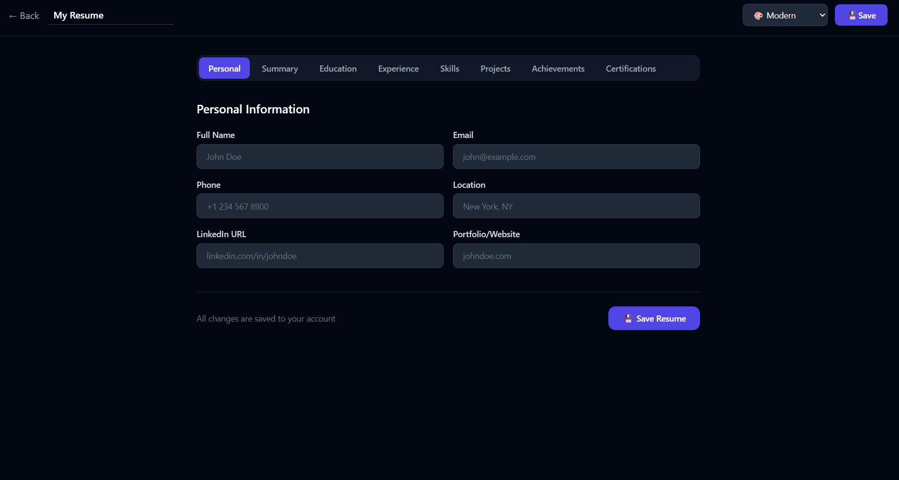
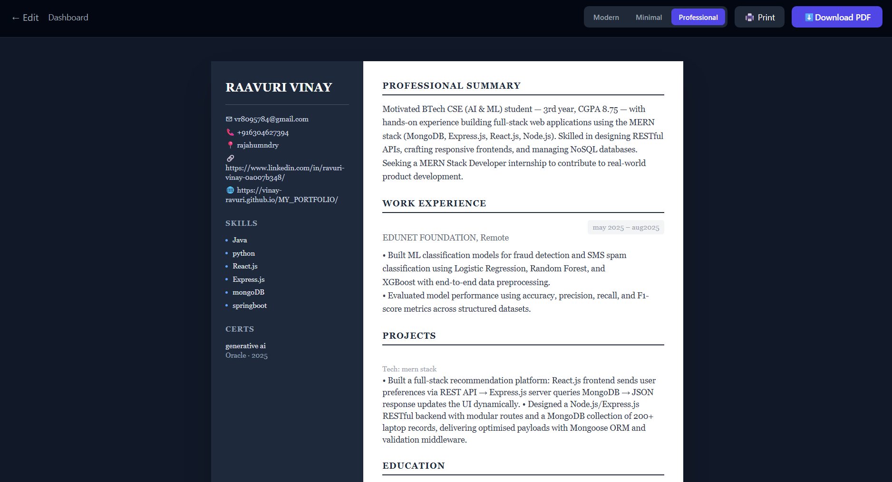

# Smart AI Resume Builder

A full-stack MERN web application that helps users create
professional resumes with AI-powered content generation.


## Live Demo
Coming soon...

## Features
-  JWT Authentication (Register/Login)
-  Resume Builder with 8 sections
-  AI-powered content generation (OpenAI)
-  3 Professional Templates (Modern, Minimal, Professional)
-  PDF Download & Print
-  Save & manage multiple resumes
-  Fully responsive design

##  Tech Stack

| Layer | Technology |
|---|---|
| Frontend | React.js, Tailwind CSS |
| Backend | Node.js, Express.js |
| Database | MongoDB Atlas |
| Authentication | JWT + Bcrypt |
| AI | OpenAI GPT-3.5 |
| PDF Export | html2canvas, jsPDF |

## 📸 Screenshots

### Landing Page


### Dashboard


### Resume Builder


### Resume Preview


## 🚀 Installation & Setup

### 1. Clone the repository
```bash
git clone https://github.com/Vinay-ravuri/smart_resume_builder.git
cd smart_resume_builder
```

### 2. Setup Backend
```bash
cd backend
npm install
```

Create `.env` file in backend folder:
```env
PORT=5000
MONGO_URI=your_mongodb_atlas_uri
JWT_SECRET=your_jwt_secret
OPENAI_API_KEY=your_openai_api_key
NODE_ENV=development
```

Run backend:
```bash
npm run dev
```

### 3. Setup Frontend
```bash
cd frontend
npm install
npm run dev
```

### 4. Open in browser
```
http://localhost:5173
```

## 📁 Folder Structure
```
smart_resume_builder/
├── backend/
│   ├── controllers/
│   ├── routes/
│   ├── models/
│   ├── middleware/
│   ├── server.js
│   └── .env
├── frontend/
│   ├── src/
│   │   ├── pages/
│   │   ├── components/
│   │   ├── context/
│   │   └── services/
│   └── index.html
├── screenshots/
└── README.md
```

## 👨‍💻 Author
**Vinay Ravuri**
- GitHub: [@Vinay-ravuri](https://github.com/Vinay-ravuri)

##  License
MIT License