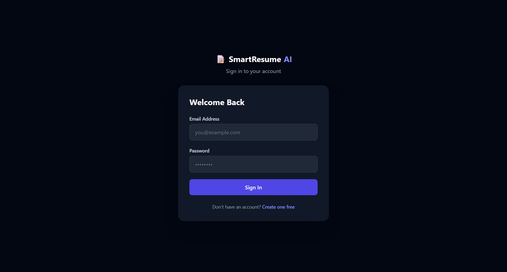
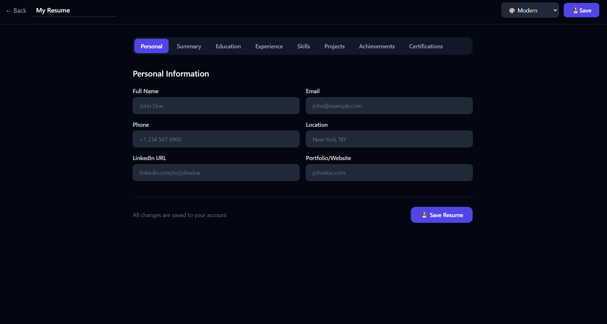
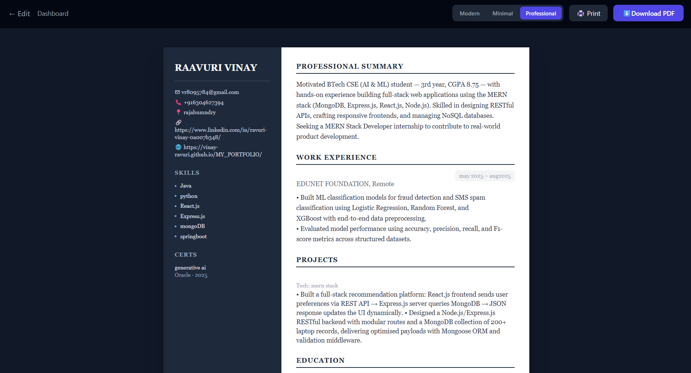

# 📝 Resume Builder — Java Spring Boot

A full-stack Resume Builder application built with Java Spring Boot backend and React.js frontend.


## 🔗 Live Demo
Coming soon...

## 🛠️ Tech Stack

| Layer | Technology |
|---|---|
| Frontend | React.js, Tailwind CSS |
| Backend | Java 17 + Spring Boot 3.x |
| Database | MySQL + Spring Data JPA |
| ORM | Hibernate |
| Architecture | REST API — 3 Layer (Controller→Service→Repository) |
| PDF Export | html2canvas, jsPDF |

## ✨ Features
- 👤 User Profile Management (Create/Read/Update/Delete)
- 📄 Full Resume CRUD Operations
- 🎨 Multiple Resume Templates (Modern, Minimal, Professional)
- 📥 PDF Download & Print
- 🗄️ MySQL Database with JPA Entity Relationships
- 🔗 RESTful API Architecture
- 📱 Fully Responsive Design

## 📸 Screenshots

### 🏠 Landing Page


### 📊 Dashboard


### ✏️ Resume Builder


### 👁️ Resume Preview


## 🏗️ Architecture

```
React Frontend (port 5173)
        ↓
Spring Boot REST API (port 8080)
        ↓
Service Layer (Business Logic)
        ↓
Repository (Spring Data JPA)
        ↓
MySQL Database
```

## 📁 Folder Structure

```
resume-builder/
├── backend/
│   └── src/main/java/
│       └── com/resumebuilder/
│           ├── controller/
│           │   └── ResumeController.java
│           ├── service/
│           │   └── ResumeService.java
│           ├── repository/
│           │   ├── UserProfileRepository.java
│           │   └── ResumeRepository.java
│           ├── model/
│           │   ├── UserProfile.java
│           │   └── Resume.java
│           └── ResumeBuilderApplication.java
├── frontend/
│   └── src/
│       ├── pages/
│       ├── components/
│       ├── context/
│       └── services/
├── screenshots/
└── README.md
```

## 🔗 API Endpoints

| Method | Endpoint | Description |
|---|---|---|
| POST | `/api/users` | Create user profile |
| GET | `/api/users/{id}` | Get user profile |
| PUT | `/api/users/{id}` | Update user profile |
| DELETE | `/api/users/{id}` | Delete user profile |
| POST | `/api/users/{userId}/resumes` | Create resume |
| GET | `/api/users/{userId}/resumes` | Get all resumes |
| GET | `/api/resumes/{id}` | Get single resume |
| PUT | `/api/resumes/{id}` | Update resume |
| DELETE | `/api/resumes/{id}` | Delete resume |

## 🚀 Installation & Setup

### 1. Clone the repository
```bash
git clone https://github.com/Vinay-ravuri/smart_resume_builder.git
cd smart_resume_builder
```

### 2. Setup MySQL Database
```sql
CREATE DATABASE resume_builder_db;
```

### 3. Setup Backend
Open `backend` folder in Spring Tool Suite (STS)

Configure `application.properties`:
```properties
spring.datasource.url=jdbc:mysql://localhost:3306/resume_builder_db
spring.datasource.username=root
spring.datasource.password=your_password
spring.jpa.hibernate.ddl-auto=update
server.port=8080
```

Run as Spring Boot Application ▶️

### 4. Setup Frontend
```bash
cd frontend
npm install
npm run dev
```

### 5. Open in browser
```
http://localhost:5173
```

## 🧠 Key Concepts Used

- ✅ Object Oriented Programming (OOP)
- ✅ Spring Boot REST API Development
- ✅ Spring Data JPA + Hibernate ORM
- ✅ MySQL Relational Database
- ✅ Entity Relationships (@ManyToOne)
- ✅ 3-Layer Architecture (Controller → Service → Repository)
- ✅ Exception Handling (@ControllerAdvice)
- ✅ Input Validation (@Valid, @NotBlank)
- ✅ Git Version Control

## 👨‍💻 Author
**Vinay Ravuri**
- GitHub: [@Vinay-ravuri](https://github.com/Vinay-ravuri)

## 📄 License
MIT License